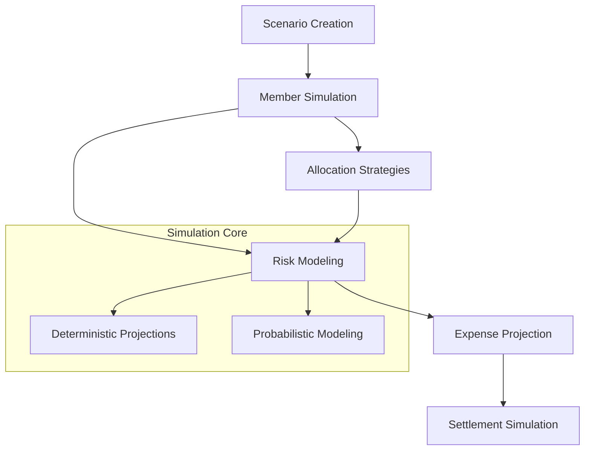

# Stop Simulator: Financial Risk Management Platform

Stop Simulator is an advanced Clarity smart contract that provides a comprehensive framework for modeling and simulating complex financial risk scenarios on the Stacks blockchain.

## Overview

Stop Simulator enables financial analysts, risk managers, and researchers to:
- Create simulated financial households
- Model intricate payment scenarios
- Track hypothetical expenses and settlements
- Analyze risk distribution across different economic models

## Core Features

- Dynamic financial scenario modeling
- Flexible expense tracking
- Complex allocation strategies
- Risk assessment tools
- Transparent settlement mechanisms

## Architecture



### Key Components:
- **Scenarios**: Base units for financial risk modeling
- **Participants**: Simulated economic actors
- **Expenses**: Projected and hypothetical financial obligations
- **Risk Metrics**: Quantitative assessment tools
- **Settlements**: Simulated resolution mechanisms

## Contract Documentation

### Stop Simulator Core Contract (`stop-simulator-core.clar`)

The primary contract handling scenario generation, participant management, and risk modeling.

#### Key Features:
- Scenario creation and management
- Participant simulation
- Expense projection
- Risk allocation strategies
- Settlement modeling

#### Access Control:
- Scenario creators have management privileges
- Participants can interact within defined parameters
- Rigorous validation of simulation inputs

## Getting Started

### Prerequisites
- Clarinet
- Stacks development environment

### Basic Usage

1. Create a simulation scenario:
```clarity
(contract-call? .stop-simulator-core create-scenario "Market Volatility Test")
```

2. Add simulated participants:
```clarity
(contract-call? .stop-simulator-core add-participant scenario-id participant-address)
```

3. Model an expense:
```clarity
(contract-call? .stop-simulator-core add-projected-expense scenario-id "Market Downturn" u1000 "probabilistic")
```

## Function Reference

### Scenario Management

```clarity
(create-scenario (name (string-ascii 100)))
(add-participant (scenario-id uint) (participant principal))
(remove-participant (scenario-id uint) (participant principal))
```

### Risk Modeling

```clarity
(add-projected-expense (scenario-id uint) (name (string-ascii 100)) (amount uint) (model-type (string-ascii 20)))
(update-risk-allocation (scenario-id uint) (participant principal) (allocation-bps uint))
```

### Settlement Simulation

```clarity
(simulate-settlement (scenario-id uint) (to-participant principal) (amount uint))
(record-simulation-outcome (scenario-id uint) (settlement-id uint))
```

## Development

### Testing
1. Clone repository
2. Install dependencies: `clarinet install`
3. Run tests: `clarinet test`

### Local Development
1. Start local chain: `clarinet console`
2. Deploy contracts: `clarinet deploy`

## Security Considerations

### Limitations
- Maximum 20 participants per scenario
- Projected amounts must be positive integers
- Complex allocation strategies require careful modeling

### Best Practices
- Validate simulation parameters thoroughly
- Use probabilistic modeling judiciously
- Cross-reference multiple risk models
- Document all simulation assumptions

The system provides robust validation for:
- Scenario authorization
- Participant interactions
- Risk model integrity
- Settlement projections